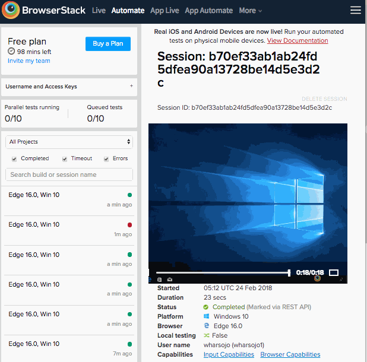
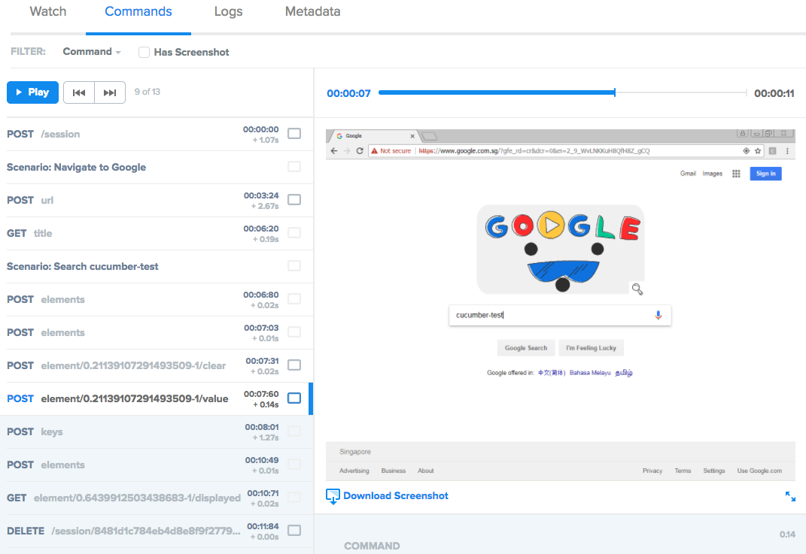

# Cucumber Test

Made easy - Cucumber testing using webdriver.io, instead of writing complicated
test code that only developers can understand, Cucumber maps an ordinary
language to code and allows to start with the test process in the early stages
of your product development. `cucumber-test` is a fork of
`cucumber-boilerplate`.

## Quick start

1. npm install -g cucumber-test selenium-standalone
2. selenium-standalone install
3. selenium-standalone start
4. create folder `features`
5. add file `features/simple.feature`
6. run `cct` (or `cct -b chrome,firefox,safari --timeout 40000 -i 3`)

if step 2,3 show some warnings, might be behind proxy / VPN, please check section `Behind Proxy / VPN:` below.

```cucumber
@simple
Feature:
    Search on Google

Scenario: Navigate to Google
    Given I open the url "https://www.google.com"
    Then I expect that the title is "Google"

Scenario: Search cucumber-test
    When I set "cucumber-test" to the inputfield "[name=q]"
    And I expect that element "input.lsb" becomes visible
    And I click on the button "input.lsb"
    Then I expect that element "a[href='https://cucumber.io/']" becomes visible
```

## Extended tags
Extended tags will simplify how to write cucumber with different browser & environment, those information are available on the browser object, utilize during execution of the cucumber file:
```js
// Browsers
@__chrome            ><  @__non_chrome
@__safari            ><  @__non_safari
@__firefox           ><  @__non_firefox
@__microsoftedge     ><  @__non_microsoftedge
@__internetexplorer  ><  @__non_internetexplorer

// Mobile specific
@__android           ><  @__non_android
@__mobile            ><  @__non_mobile
@__ios               ><  @__non_ios
```
Sample usage can be seen on the example below `Search on Google`, when it get executed on the desktop browser like chrome, firefox or IE, it will pickup scenario with:

`@__non_safari @__non_mobile` and the `@__mobile` will be filtered

and viceversa will happened when it get executed on mobile.

## Appium
### Android Device
please check the developer tools security options, ensure them to be checked.
* USB debugging
* USB debugging(Security settings)

```cucumber
@simple
Feature: Search on Google
    Search should be on the google website
    and the first should be cucumber.io

Scenario: Navigate to Google
    Given I open the url "https://www.google.com"
    Then I expect that the title is "Google"

@__non_safari @__non_mobile
Scenario: Search cucumber-test on desktop browser
    When I set "cucumber-test" to the inputfield "[name=q]"
    And I expect that element "input.lsb" becomes visible
    And I click on the button "input.lsb"
    Then I expect that element "a[href='https://cucumber.io/']" becomes visible

@__mobile
Scenario: Search cucumber-test on mobile browser
    When I set "cucumber-test" to the inputfield "[name=q]"
    And I expect that element "[name=btnG]" becomes visible
    And I click on the button "[name=btnG]"
    Then I expect that element "a[href='https://cucumber.io/']" becomes visible
```
```bash
# Install appium server
npm install -g appium appium-doctor
# run appium & connect your android device using USB
appium
# check deviceName - adb devices & pass to deviceName:android version
cct --android f344ee26:7.0
```

## Config & Variables
Setting up browsers capabilities and adding variables that can be use inside steps statement. Put `config.js` in the current folder (above features folder) where you will run cucumber-test.

`share.feature`
```cucumber
Feature: Share Scenario
    To be share during automation

Scenario: Navigate to Google
    Given I open the url "https://www.google.com"
    Then I expect that the title is "Google"
```

`google/google.feature`
```cucumber
Feature: Search on Google
    Search should be on the google website
    and the first should be cucumber.io

Scenario: Navigate to Google
    Given ...

@__non_mobile
Scenario: Search cucumber-test
    When I type "cucumber-test" to the inputfield "${g.q}"
    And I expect that element "${g.btnG}" becomes visible
    And I click on the button "${g.btnG}"
    Then I expect that element "a[href='https://cucumber.io/']" becomes visible

@__mobile
Scenario: Search cucumber-test
    When I type "cucumber-test" to the inputfield "${g.q}"
    And I expect that element "${g.btnM}" becomes visible
    And I click on the button "${g.btnM}"
    Then I expect that element "a[href='https://cucumber.io/']" becomes visible
```

`config.js`
```js
module.exports = (faker) => {
    return {
        browsers: {
            chrome: {},
            firefox: {},
            safari: { platform: 'MAC' }
        },
        browserstack: {
            browsers: {
                browserName: 'microsoftEdge',
                platform: 'Windows 10',
                version: '16'
            },
            browser: 'edge'
        },
        saucelabs: {
            browsers: {
                chrome: {
                    platform: 'WIN7',
                    version: '65'
                },
                firefox: {
                    platform: 'WIN7',
                    version: '59'
                },
                "firefox:m52": {
                    platform: 'MAC',
                    version: '52'
                },
                safari: {
                    platform: 'macOS 10.12',
                    version: '10.1'
                },
                edge: {
                    browserName: 'microsoftEdge',
                    platform: 'Windows 10',
                    version: '16.16299'
                },
                ie: {
                    browserName: 'internet explorer',
                    platform: 'WIN7',
                    version: '11'
                }
            },
            browser: 'chrome,firefox,safari,edge,ie'
        },
        perfecto: {},
        remote: {
            remote: 'http://10.193.94.142:4444', //'http://localhost:4444',
            browser: 'firefox,chrome'
        },
        general: {
            android: 'f344ee26:7.0',
            browser: 'firefox,chrome,safari',
            retry: 6
        },
        vars: {
            g: {
                q: '[name=q]',
                btnG: 'input.lsb', //'[name=btnK]',
                btnM: 'button._S6q',
                search: 'cucumber-test',
                url: 'https://google.com',
                cucumberIo: "a[href='https://cucumber.io/']",
                email: faker.internet.email()
            }
        }
    }
}
```
`config.js` will automatically pickup by runner or you can provide the fullpath in CLI:
```bash
cct -f google --config ./config.js -b chrome
cct -f google -b chrome,safari,firefox
```

## Integration with: BrowserStack
Add these env variables from your BrowserStack user & key:
```bash
export BROWSERSTACK_ACCESS_KEY=xxXXXxXxXxXxxXxXXXxx
export BROWSERSTACK_USERNAME=cucumber-test
cct -c browserstack
```



## Integration with: Sauce Labs
Add these env variables from your SauceLabs user & key:
```bash
export SAUCE_ACCESS_KEY=xxxxxxxx-xxxx-xxxx-xxxx-xxxxxxxxxxxx
export SAUCE_USERNAME=cucumber-test
cct -c saucelabs:connect
cct -c saucelabs
```



## Behind Proxy / VPN:

```bash
npm install -g selenium-standalone@latest
NODE_TLS_REJECT_UNAUTHORIZED=0 selenium-standalone install
NODE_TLS_REJECT_UNAUTHORIZED=0 selenium-standalone start
NODE_TLS_REJECT_UNAUTHORIZED=0 cct -t '@smoke'
```

## Dev Mode

```bash
cd ~/.nvm/versions/node/v8.8.1/lib/node_modules
ln -s /Users/wharsojo/Dev/cucumber-test cucumber-test
```

## License

MIT
